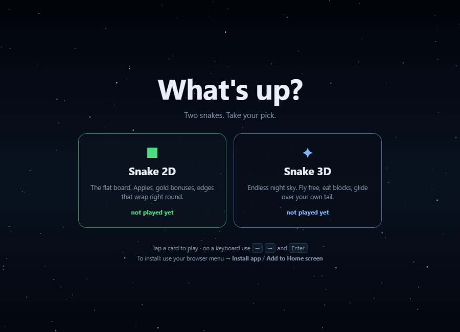
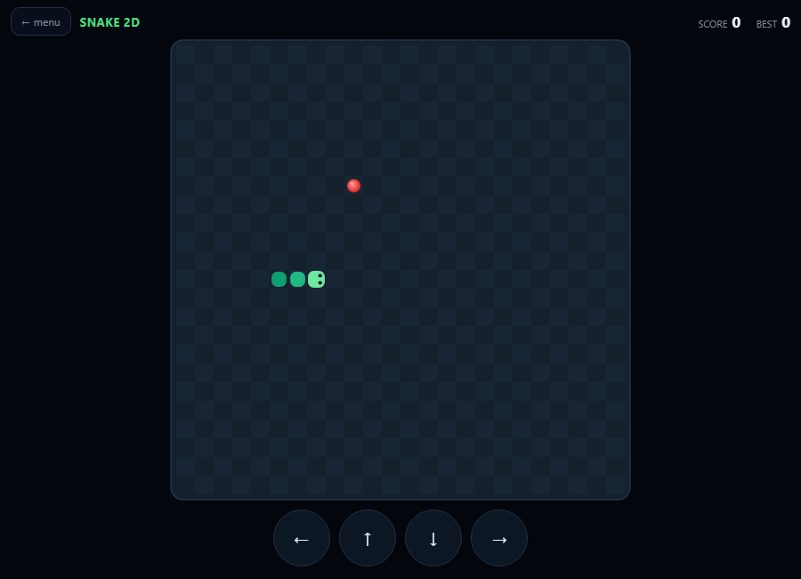
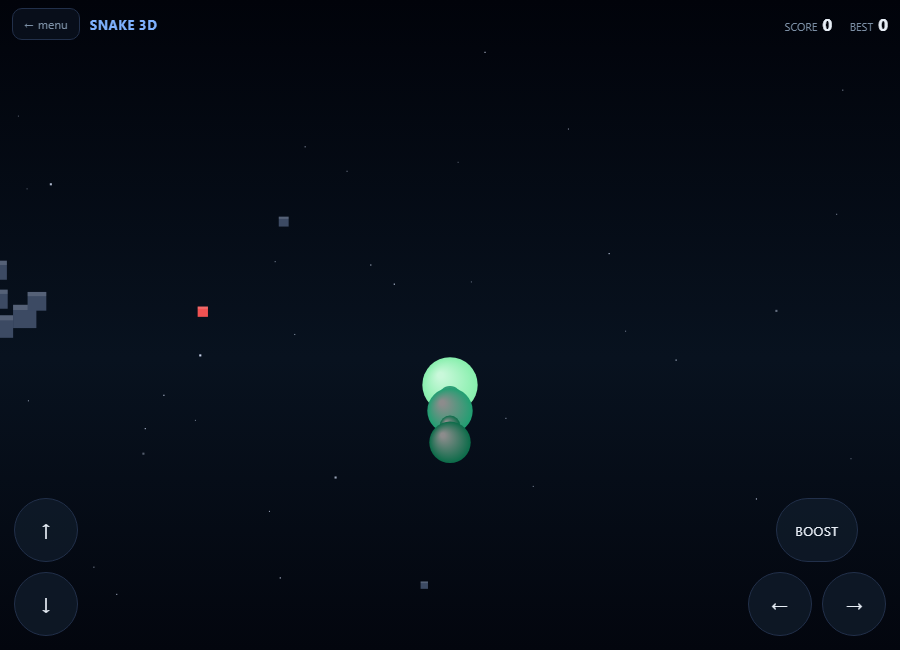

# Snake

Two snakes in one place: a flat board with wrap-around edges, and an endless
3D night sky you fly through. A native Windows app, and a web version that
installs to the home screen on Android, iPhone and Mac.

**Play: https://sumannumb3r15.github.io/snake/**



| Snake 2D | Snake 3D |
| --- | --- |
|  |  |

## The two games

**Snake 2D** - the flat board. Apples, gold bonuses worth 5, and no walls: the
edges wrap right round. Biting yourself is the only way to lose.

**Snake 3D** - open space with no edges, no walls and nothing that can end a
run. You fly in six directions, banking and climbing relative to your own
heading, and glide up over your own tail and over rocks rather than dying on
them. The world is unbounded: space is diced into chunks and each chunk's
contents come from a hash of its coordinates, so the layout is fixed and
stretches out forever. Nothing pops into being in front of you, and a block
you flew past is in exactly the same place when you come back for it.

## Controls

|          | Snake 2D                    | Snake 3D                                      |
| -------- | --------------------------- | --------------------------------------------- |
| Keyboard | arrows or WASD              | left/right bank, up/down climb-dive, Shift boost |
| Touch    | thumb stick, or swipe       | thumb stick to bank and climb, BOOST button   |
| Back     | Esc, or the **menu** button | Esc, or the **menu** button                   |

`#2d` and `#3d` on the end of the URL jump straight into a game.

## Install it

- **Android** - open the link in Chrome, then menu, *Install app*.
- **iPhone** - open the link in Safari, then Share, *Add to Home Screen*.
  Safari only; Apple does not let other browsers install web apps.
- **Mac** - Safari 17+: File, *Add to Dock*. Chrome/Edge: menu, *Install page
  as app*.
- **Windows** - download `Snake.exe` and run it, or run `install-windows.ps1`
  to add Start-menu and Settings entries.

Once installed, the web version works with no connection at all.

## What's in here

```
Snake.exe             the native Windows app
install-windows.ps1   installs it properly (-Uninstall to remove)
send/                 single files to hand to someone
docs/                 the web app - this folder is what GitHub Pages serves
source/               C# sources and the build script
```

## Building

Nothing to install. `source/build.ps1` compiles `Snake.exe` with the C#
compiler that ships inside Windows (`C:\Windows\Microsoft.NET\Framework64\`),
so there is no .NET SDK, no project file and no package restore.

```powershell
.\source\build.ps1            # rebuilds Snake.exe
.\source\build.ps1 -Capture   # also builds the headless test binary
```

The web version needs no build at all - edit `docs/index.html` and refresh.
`docs/serve.ps1` serves the folder over your own Wi-Fi if you want to try it
on a phone without publishing.

## How it is put together

The Windows app is a single 58 KB executable holding all three pieces: a WPF
launcher that opens either game, the 2D board drawn with WinForms and GDI+,
and the 3D game in WPF 3D. There are no dependencies beyond what Windows
already has.

The web version is one self-contained HTML file. The 3D game there is a
hand-written renderer - project, depth-sort, paint - rather than WebGL, which
suits a world made of spheres and blocks and keeps the whole thing dependency
free.

`source/Snake3D.cs` carries a test harness behind `#if CAPTURE` that renders
frames straight out of the live app and checks the world's guarantees: that
leaving and returning finds the world unchanged, that eating a block removes
exactly that block, and that the snake lifts clear of its own tail.
